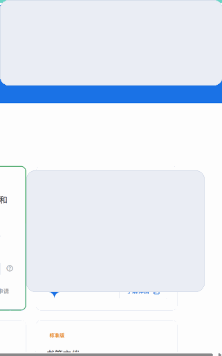

# AI MarkMaster Extension

[English README](README.en.md)

AI MarkMaster 是一个 Chrome 扩展，使用 DeepSeek AI 自动整理书签，支持自动分类、低置信度保护、历史重整和语义检索。

## 功能亮点

- 自动分类：新建书签后自动识别并移动到目标文件夹。
- 低置信度保护：不确定结果会进入 `待二次判断`，避免误分。
- 智能检索：支持标题/域名/路径模糊搜索 + AI 语义检索。
- 历史重整：支持一键整理历史书签和按文件夹重整。
- 规则学习：高置信度结果会逐步沉淀域名规则，减少重复判断。

## 截图展示

### 使用效果

<p align="center">
  
  
  
</p>

> 注：演示图已做初始化与去个人化处理，不包含个人账号和历史数据。

## 安装使用

1. 克隆或下载本仓库。
2. 打开 Chrome，访问 `chrome://extensions/`。
3. 开启“开发者模式”。
4. 点击“加载已解压的扩展程序”，选择本项目目录。
5. 打开扩展弹窗，填写 DeepSeek API Key。

## 隐私与权限

- 权限：`bookmarks`、`history`、`storage`、`notifications`。
- 网络：访问 DeepSeek API，以及目标网页公开 HTML 信号（用于分类）。
- API Key 当前存储在 `chrome.storage.sync`（便于多设备同步）。
- 自动分类/重整：发送当前书签及必要页面信号（标题、域名等）。
- AI 检索：发送本地书签样本（当前实现最多约 1000 条标题+URL）用于语义匹配。

## 开发检查

```bash
node --check background.js
node --check popup.js
node -e "JSON.parse(require('fs').readFileSync('manifest.json','utf8')); console.log('manifest ok')"
```

## 项目结构

```text
.
├─ background.js
├─ popup.html
├─ popup.css
├─ popup.js
├─ manifest.json
├─ icons/
├─ assets/
│  └─ screenshots/
├─ docs/
│  └─ ROADMAP.zh-CN.md
└─ .github/
```

更多规划见 [docs/ROADMAP.zh-CN.md](docs/ROADMAP.zh-CN.md)。

## 贡献

提交 PR 前请先阅读 [CONTRIBUTING.md](CONTRIBUTING.md)。

## License

[MIT](LICENSE)
